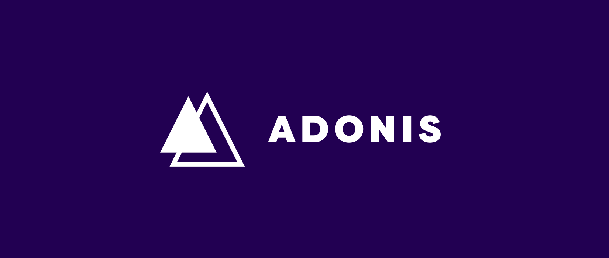

[](https://semver.org)

# Inventory Management API with Adonis




## Getting Started
  
  Install Node modules `npm install`
  
  Start MongoDB  `sudo service mongod start`
  
  Run the development server `adonis serve --dev`
  

This is the fullstack boilerplate for AdonisJs, it comes pre-configured with.

1. Bodyparser
2. Session
3. Authentication
4. Web security middleware
5. CORS
6. Edge template engine
7. Lucid ORM
8. Migrations and seeds

## Setup

Use the adonis command to install the blueprint

```bash
adonis serve 
```

or manually clone the repo and then run `npm install`.


### Migrations

Run the following command to run startup migrations.

```js
adonis migration:run
```
